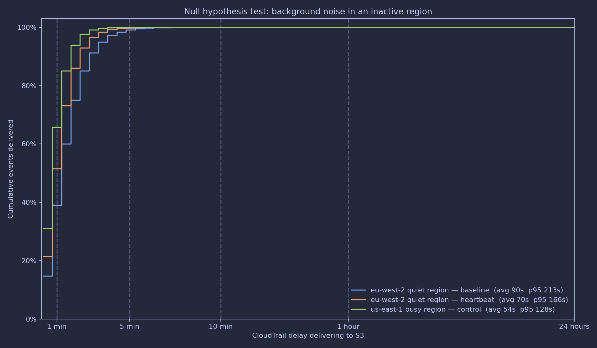

# Can background noise make CloudTrail faster in inactive regions?

**Testing a hypothesis from Sam Cox's post
["How fast is CloudTrail today? Investigating CloudTrail delays using Athena"](https://tracebit.com/blog/how-fast-is-cloudtrail-today-investigating-cloudtrail-delays-using-athena)**
(notebook: [`tracebit-com/cloudtrail-latency-investigation`](https://github.com/tracebit-com/cloudtrail-latency-investigation)).

He ended that post with an open question:

> *"Is it possible to induce a noticeably lower average delay in inactive
> regions by creating a small but frequent level of background noise; say by
> calling `GetCallerIdentity` every 30 seconds or so?"*

This repo is a self-contained, reproducible attempt to answer it with real data
using his own methodology and plotting style.

---

## Why this matters

Tracebit's whole pitch is detecting intrusions **in seconds, not months**, and
the detection pipeline sits downstream of CloudTrail's S3 delivery. If the
delivery delay you can actually achieve varies by region and by whether a region
is "warm", that has a real effect on how you size and tune a deception/watcher
platform. Sam found busy regions delivered logs in ~2m44s while quiet regions
*waited the full ~5 minutes* for nearly everything. The hand grenade he left
unsolved is: **can you make a quiet region look "busy" cheaply?**

---

## The experiment

1. **Terraform** provisions a multi-region CloudTrail trail (`is_multi_region`),
   an S3 bucket, an Athena partition-projection table, and a scheduled
   heartbeat Lambda (EventBridge Scheduler → Lambda → `sts:GetCallerIdentity`
   + `ec2:DescribeAvailabilityZones`) in the *quiet* region only.
2. **Baseline window** — measure the delay in the quiet region *before* the
   heartbeat is enabled (noise OFF).
3. **Treatment window** — enable the heartbeat (noise ON), measure the same
   region again.
4. **Control** — measure the *busy* region over the treatment window for scale.

### Conditions

| Condition | Region | Noise | What it isolates |
|---|---|---|---|
| Quiet baseline | quiet | OFF | natural delay in a cold region |
| Quiet + heartbeat | quiet | ON (every ~30s) | *the hypothesis* |
| Busy control | busy | n/a | the target we'd like to reach |

The null hypothesis: heartbeat makes no difference. If quiet+heartbeat's delay
curve shifts left toward the busy control (and its avg/p95 drop), we can reject
the null and tellingly answer the CTO's question.

## Files

```
terraform/
  versions.tf         provider + backend pinning
  providers.tf        aws provider, caller identity
  variables.tf        all tunables (regions, cadence, retention)
  storage.tf          CloudTrail S3 bucket + Athena results bucket (encryption, lifecycle, policy)
  cloudtrail.tf       multi-region trail (management events, log-file validation)
  athena.tf           Glue DB + partition-projection table + Athena workgroup
  heartbeat.tf        Lambda IAM/role/policy, zip payload, EventBridge Scheduler
  outputs.tf          bucket / trail / db / table / workgroup / lambda ARNs
heartbeat/lambda/heartbeat.py    the noise generator (30s cadence, per-region)
analysis/
  partition_utils.py            dependency-light partition predicate helper (used by CI tests)
  run_analysis.py               runs the summary query per condition + plots the chart
  queries/01_summary_by_region.sql   delay stats by region (from Sam's notebook)
  queries/02_heartbeat_noise_events.sql  verify the noise events exist
  queries/03_cloudtrail_lake_latency.sql  optional: S3 path vs CloudTrail Lake ingestion latency
  tests/test_partition_predicate.py   partition predicate unit tests
  tests/test_chart_smoke.py           synthetic chart render smoke test (no AWS)
.github/workflows/ci.yml   CI: terraform validate + py compile + tests + optional real analysis
requirements.txt          pandas/awswrangler/matplotlib stack
```

### CI

`.github/workflows/ci.yml` is green with **no secrets**. It runs `terraform fmt`
+ `terraform validate`, compiles the Python, runs the partition unit tests, and
renders the chart from synthetic data as an AWS-free smoke test. The optional
`analysis` job (manual dispatch) only runs if you supply AWS credentials + the
experiment dates as repo secrets/vars — so the showcase repo never requires
secrets just to pass CI.

## Setup

### 1. Provision

```bash
cd terraform
terraform init
# edit variables.tf — set a unique project_prefix, your busy + quiet regions
terraform plan -out plan.tfplan
terraform apply plan.tfplan
```

You must run this in a region/account where you already have *some* activity for
the "busy" side; otherwise pick a second quiet region as the control.

### 2. Confirm CloudTrail is delivering (allow ~10 min for logs to appear)

`aws glue get-table --database-name cloudtrail_latency --name cloudtrail_logs`
then a quick sanity query in Athena or via the scripts below.

### 3. Before you start the heartbeat — take the baseline

Pick a window of at least 24–48h **before** you enable the scheduler. Note the
dates. Do **not** enable the heartbeat during this window.

### 4. Start the noise

```bash
aws scheduler start-schedule --name <prefix>-heartbeat-schedule
```

Leave it running for the same-length treatment window (24–48h).

### 5. Analyse + plot

```bash
pip install -r requirements.txt
cd analysis
python run_analysis.py \
  --busy-region us-east-1 --quiet-region eu-west-2 \
  --baseline-start 2026/08/01 --baseline-end 2026/08/03 \
  --heartbeat-start 2026/08/05 --heartbeat-end 2026/08/07 \
  --out delay_comparison.png
```

`run_analysis.py` runs the exact summary query from Sam's notebook for each
condition, then plots the cumulative delay distribution on his symlog axis
(1/5/10 min, 1h, 24h ticks, dashed lines, % y-axis) and prints the avg/p95/p99
table. Looks like:



> **⚠️ The image above is a synthetic placeholder** produced from made-up
> numbers solely to confirm the chart renders (same code, same style). Replace
> it with your real output — don't confuse it with a measured result.

### 6. (Optional) sanity-check the noise landed

```sql
-- see the per-method heartbeat events + their own delay
SELECT eventsource, eventname, count(*) AS count,
       avg(s3_write_delay_seconds) AS avg_delay_s,
       approx_percentile(s3_write_delay_seconds, 0.95) AS p95_delay_s
FROM cloudtrail_logs
WHERE eventdate BETWEEN '2026/08/05' AND '2026/08/07'
  AND region='eu-west-2'
  AND eventname IN ('GetCallerIdentity','DescribeAvailabilityZones','DescribeRegions')
GROUP BY eventsource, eventname;
```

## Cost

Essentially free-tier territory:

- **Heartbeat Lambda**: 2 calls/min across the quiet region, a few hundred ms,
  near-zero compute. The Scheduler trigger is free.
- **CloudTrail**: sends ~2 management events/min; S3 + Athena storage of tiny
  JSON files is negligible (the `lifecycle` rules expire logs after
  `cloudtrail_log_retention_days`).
- **Athena**: scanning a couple of days of a small account is a few **cents**
  to well under $1. The `bytes_scanned_cutoff_per_query` (10 GB) and a tightened
  `trail_regions` list keep it bounded.

## Honest caveats (read before you claim a result)

- **STS is global.** `sts:GetCallerIdentity` is recorded by CloudTrail in
  `us-east-1` regardless of which regional STS endpoint you hit, so it does
  **not** by itself create noise in a specific region. That's why the heartbeat
  pairs it with `ec2:DescribeAvailabilityZones` — a *regional*, read-only call
  that is guaranteed to land in the target region's partition. This is a genuine
  refinement of the original question, not just an implementation detail.
- **EventBridge Scheduler min cadence is 1 minute**, not 30s. The Lambda
  emulates 30s by issuing 2 passes per minute, spaced 30s apart, and stays under
  the 60s period to avoid overlap.
- **Sample size & window length matter.** A single 24h window in a truly quiet
  region yields few events, so the histogram is coarse and percentiles noisy.
  Use comparable, longer windows for baseline/treatment, and note that a single
  noisy *file* can dominate. Replicate over several days.
- **The mechanism may be batching, not "region warmness".** A near-empty file
  waits for CloudTrail's cadence to close it out; a frequent trickle of events
  may simply keep files "open" and get flushed sooner. That interpretation is
  itself interesting — if the effect shows up, check whether it's real
  end-to-end latency or just file-finalisation timing.
- **Account-wide traffic can confound "quiet".** Use an account where you
  control activity (a dedicated throwaway account is ideal).

## Reading the result

- **If quiet+heartbeat ≈ busy control (< busy baseline-ish curve)**: the
  hypothesis holds — cheap background noise meaningfully lowers CloudTrail
  delivery delay in inactive regions, which matters for "seconds, not months"
  detection latency in low-traffic fleets.
- **If no shift**: the answer is also useful — noise doesn't buy you much, so
  delay is a function of the region/service, not activity. Either way you've
  answered the question with data, which was the point.

## What I'd do next

- Add `CloudTrail Lake` ingestion as an alternative event source for a
  latency-vs-EventBridge comparison (EventBridge is near-instantaneous; the
  question is S3 specifically).
- Add an `aws-athena` + `aws-sdk-go` re-run inside the same repo for a
  no-human-in-the-loop CI run.
- Expand to a second quiet region as a "no-op" control to rule out account-wide
  effects.

---

*Reproduced methodology & chart style from Sam Cox's notebook (Apache-2.0).
Experiment implementation, billing-safe guardrails, and the heartbeat are new.*
